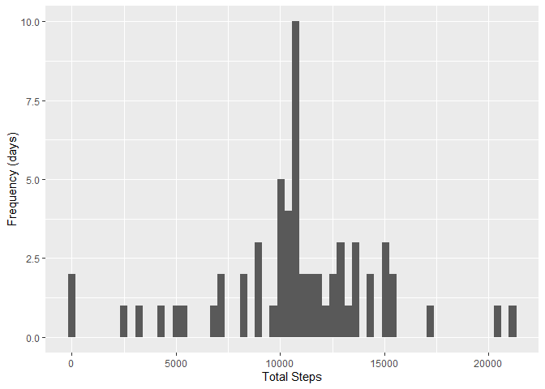

## Loading and preprocessing the data

```r
library(dplyr)
```

```
## 
## Attaching package: 'dplyr'
```

```
## The following objects are masked from 'package:stats':
## 
##     filter, lag
```

```
## The following objects are masked from 'package:base':
## 
##     intersect, setdiff, setequal, union
```

```r
library(ggplot2)
library(lubridate)
```

```
## Loading required package: timechange
```

```
## 
## Attaching package: 'lubridate'
```

```
## The following objects are masked from 'package:base':
## 
##     date, intersect, setdiff, union
```

```r
library(scales)

tempactivity <- tempfile()
download.file("https://d396qusza40orc.cloudfront.net/repdata%2Fdata%2Factivity.zip",tempactivity, mode="wb")
unzip(tempactivity, "activity.csv")
unlink(tempactivity)

activityDF <- read.csv("activity.csv", header=TRUE)

# change data type of date column to Date
activityDF$date <- as.Date(activityDF$date)
```


## What is mean total number of steps taken per day?

```r
###   For this part of the assignment, you can ignore the missing values in the dataset.
activityNoNAsDF <- na.omit(activityDF)

# 1. Calculate the total number of steps taken per day
activityNoNAsByDateDF <- group_by(activityNoNAsDF, date)
activityNoNAsDailyDF <- summarize(activityNoNAsByDateDF, total_steps=sum(steps))

# 2. If you do not understand the difference between a histogram and a barplot, research the difference between them. 
# Make a histogram of the total number of steps taken each day
acthist <- ggplot(activityNoNAsDailyDF, aes(x=total_steps)) + geom_histogram(bins=60) +
  labs(x="Total Steps", y="Frequency (days)")
acthist
```

<!-- -->

```r
# 3. Calculate and report the mean and median of the total number of steps taken per day
meanActivity <- round(mean(activityNoNAsDailyDF$total_steps),0)
medianActivity <- round(median(activityNoNAsDailyDF$total_steps),0)
print(paste("Mean total number of steps per day = ", meanActivity))
```

```
## [1] "Mean total number of steps per day =  10766"
```

```r
print(paste("Median total number of steps per day = ", medianActivity))
```

```
## [1] "Median total number of steps per day =  10765"
```


## What is the average daily activity pattern?

```r
# 1.  Make a time series plot (i.e. 
#                           type = "l") of the 5-minute interval (x-axis) and the average number of steps taken, averaged across all days (y-axis)
activityNoNAsIntervalDF <- group_by(activityNoNAsDF, interval)
activityNoNAsIntervalMeanDF <- summarize(activityNoNAsIntervalDF, mean_steps=mean(steps))

plot(activityNoNAsIntervalMeanDF$interval, activityNoNAsIntervalMeanDF$mean_steps, type = "l", , xlab = "Interval", ylab = "Mean Number of Steps")
```

<!-- -->

```r
# 2. Which 5-minute interval, on average across all the days in the dataset, contains the maximum number of steps?
maxMeanSteps <- max(activityNoNAsIntervalMeanDF$mean_steps)
maxAvgStepsInterval <- filter(activityNoNAsIntervalMeanDF, activityNoNAsIntervalMeanDF$mean_steps==maxMeanSteps)$interval   
print(paste("Max average 5-minute interval number of steps across all days = ", maxAvgStepsInterval))
```

```
## [1] "Max average 5-minute interval number of steps across all days =  835"
```

## Imputing missing values

```r
# 1. Calculate and report the total number of missing values in the dataset (i.e. the total number of rows with NAs)
numRowsMissingVals <- sum(!complete.cases(activityDF)) 
print(paste("Total number of rows with NAs (missing values) = ", numRowsMissingVals))
```

```
## [1] "Total number of rows with NAs (missing values) =  2304"
```

```r
# 2. Devise a strategy for filling in all of the missing values in the dataset. 
# The strategy does not need to be sophisticated. For example, you could use the mean/median for that day, 
# or the mean for that 5-minute interval, etc.
# Decided to replace NAs with median value of the step

# Create a new dataset that is equal to the original dataset but with the missing data filled in.

# First join activity table by interval with existing table that has mean values per interval.
activityFillDF <- merge(activityDF,activityNoNAsIntervalMeanDF,by = "interval") 

# Next, replace steps that are NA with mean value per interval.
activityFillDF <- activityFillDF %>%
  mutate(steps = ifelse(is.na(steps)==TRUE, mean_steps, steps))

# Make a histogram of the total number of steps taken each day and Calculate and report the mean and median total number of steps taken per day. 
# Do these values differ from the estimates from the first part of the assignment? 
# What is the impact of imputing missing data on the estimates of the total daily number of steps?
activityFillByDateDF <- group_by(activityFillDF, date)
activityFillDailyDF <- summarize(activityFillByDateDF, total_steps=sum(steps))

# Make a histogram of the total number of steps taken each day
actFillHist <- ggplot(activityFillDailyDF, aes(x=total_steps)) + geom_histogram(bins=60) +
  labs(x="Total Steps", y="Frequency (days)")
actFillHist
```

<!-- -->

```r
# Calculate and report the mean and median total number of steps taken per day. 
meanActivityFill <- round(mean(activityFillDailyDF$total_steps),0)
medianActivityFill <- round(median(activityFillDailyDF$total_steps),0)
print(paste("Mean total number of steps per day with imputed missing values = ", meanActivityFill))
```

```
## [1] "Mean total number of steps per day with imputed missing values =  10766"
```

```r
print(paste("Median total number of steps per day with imputed missing values = ", medianActivityFill))
```

```
## [1] "Median total number of steps per day with imputed missing values =  10766"
```

```r
# Do these values differ from the estimates from the first part of the assignment? 
print("No, there is virtually no difference, only the median changed slightly:")
```

```
## [1] "No, there is virtually no difference, only the median changed slightly:"
```

```r
print(paste("Difference (absolute value) in mean value from first part of assignment = ", abs(meanActivity - meanActivityFill)))
```

```
## [1] "Difference (absolute value) in mean value from first part of assignment =  0"
```

```r
print(paste("Difference (absolute value) in median value from first part of assignment = ", abs(medianActivity - medianActivityFill)))
```

```
## [1] "Difference (absolute value) in median value from first part of assignment =  1"
```

```r
# What is the impact of imputing missing data on the estimates of the total daily number of steps?
totalDailyNumStepsNAsIgnored <- sum(activityNoNAsDailyDF$total_steps)
# 570608

totalDailyNumStepsImputed <- sum(activityFillDailyDF$total_steps)
# 656737.5

print(paste("Impact of imputing missing data on the estimates of the total daily number of steps = ",
            round(totalDailyNumStepsImputed - totalDailyNumStepsNAsIgnored,0),
            " steps."))
```

```
## [1] "Impact of imputing missing data on the estimates of the total daily number of steps =  86130  steps."
```

## Are there differences in activity patterns between weekdays and weekends?

```r
# 1. Create a new factor variable in the dataset with two levels – “weekday” and “weekend” indicating whether a given date is a weekday or weekend day.
activityFillFactDF <- activityFillDF %>%
  mutate(day_type = factor(ifelse(weekdays(date) %in% c("Saturday","Sunday"), "weekend", "weekday")))
str(activityFillFactDF)
```

```
## 'data.frame':	17568 obs. of  5 variables:
##  $ interval  : int  0 0 0 0 0 0 0 0 0 0 ...
##  $ steps     : num  1.72 0 0 0 0 ...
##  $ date      : Date, format: "2012-10-01" "2012-11-23" ...
##  $ mean_steps: num  1.72 1.72 1.72 1.72 1.72 ...
##  $ day_type  : Factor w/ 2 levels "weekday","weekend": 1 1 2 1 2 1 2 1 1 2 ...
```

```r
# 2. Make a panel plot containing a time series plot (i.e. type = "l") of the 5-minute interval (x-axis) and 
#    the average number of steps taken, averaged across all weekday days or weekend days (y-axis). 
#    See the README file in the GitHub repository to see an example of what this plot should look like using simulated data.    

activityFillFactbyWeekdayIntervalDF <- group_by(activityFillFactDF, day_type, interval)
activityFillFactSumWeekdayIntervalDF <- summarize(activityFillFactbyWeekdayIntervalDF, mean_steps=mean(steps))
```

```
## `summarise()` has grouped output by 'day_type'. You can override using the
## `.groups` argument.
```

```r
ggplot(activityFillFactSumWeekdayIntervalDF, mapping = aes(x = interval, y = mean_steps)) +
  geom_line(aes(linetype = day_type)) +
  facet_wrap(~day_type, ncol=1) +
  ggtitle("Time Series: Weekday versus Weekend - Mean Number of Steps by 5-Minute Interval") +
  xlab("5-Minute Interval Number") +
  ylab("Mean Number of Steps")  
```

<!-- -->
